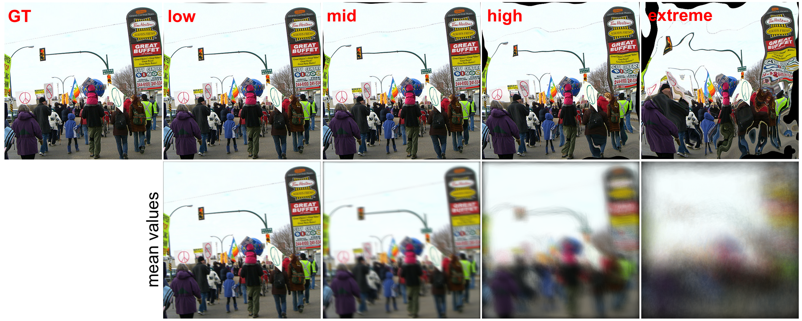

<div align="center">

# 【CVPR 2026 MaCVi】 A unified Benchmark for Multi-Frame Image Restoration under Severe Refractive Warping

</div>

### [Paper](https://arxiv.org/abs/2605.05079v1) | [Dataset](https://zenodo.org/records/19390086)

<p align="center">



</p>

Official implementation of "A unified Benchmark for Multi-Frame Image Restoration under Severe Refractive Warping" (CVPR 2026).

This project introduces a benchmark for evaluating multi-frame image reconstruction methods under severe refrctive warping conditions at air-water interface, a challenging distortion regime characterized by spatially varying geometric deformation across frames.
The benchmark enables controlled and reproducible evaluation by generating distorted image sequences procedurally from wave profiles for a specific wave type and background images provided with abovelisted dataset.

## Performance Evaluation

|argument|description|
|-|-|
|--dataset\_root|root directory of the above dataset with backgrounds and wave profiles.|
|--wave\_type|wave type ocean/shallow/sine/ripple|
|--amplitude|wave amplitude low/mid/high/extreme|
|--L|number of frames in eval|
|--method|evaluated method ref/mean/grid\_registration/grid\_deformation/datum|

```
python eval.py --dataset\_root ${your\_data\_path} --L 1 --wave\_type ocean --amplitude low --method ref
python eval.py --dataset\_root ${your\_data\_path} --L 49 --wave\_type ripple --amplitude mid --method datum
python eval.py --dataset\_root ${your\_data\_path} --L 200 --wave\_type sine --amplitude high --method grid\_registration
```

Download the provided dataset for wave profiles and backgrounds.

## Citation

Please consider citing our work as follows if it is helpful.

```

```

